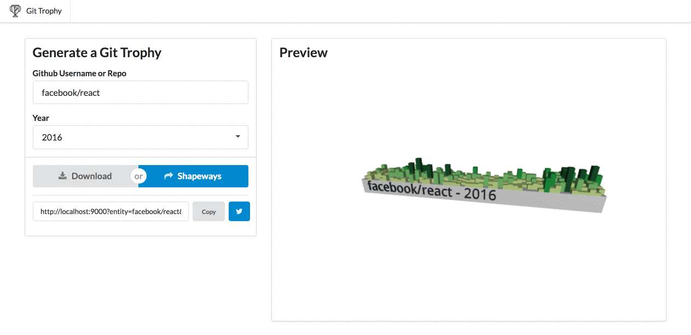

# git-trophy

🏆 Create a 3D Printed Model of Your Github Contributions

## Demo:

[](https://gittrophy.com)

## Architecture / Design
_TODO_

## Run it yourself

```bash
git clone https://github.com/bcongdon/git-trophy
cd git-trophy

# Start the site
npm i
npm start

# Deploy the lambdas
cd git_trophy_lambda
virtualenv venv
source venv/bin/activate
pip install -r requirements.txt
zappa deploy

# Publish the site
cd ..
npm run deploy
```

This repo isn't necessarily meant to be used to create an independent deployment of git-trophy, but there's nothing stopping you if you want to!

**Note**: To deploy the backend/frontent you'll have to setup your [AWS credentials](https://aws.amazon.com/blogs/security/a-new-and-standardized-way-to-manage-credentials-in-the-aws-sdks/)

* Alternatively, you can run the backend locally with `python git_trophy_lambda/app.py`
* You'll also need to...
    * edit the lambda URL in `src/actions.js` (Set `BASE_URL` to the lambda URL)
    * change the S3 deployment bucket in `package.json`
    * change the S3 cache bucket in `git_trophy_lambda/zappa_settings.json`
    * change the Shapeways OAuth clientId in `src/oauth.js`

## Related Projects
* [git_lambda](https://github.com/bcongdon/git_lambda) - Run [Blender](https://www.blender.org/) in AWS lambda
* [bpy_lambda](https://github.com/bcongdon/bpy_lambda) - Run `git` in a Python lambda subprocess

## Attribution

* Thanks to [Aaron Francis](https://twitter.com/aarondfrancis) for his help in getting contribution stats for repositories (and inspiration via [Commit Print](commitprint.com))!

* Trophy Icon from [NounProject](https://thenounproject.com/search/?q=trophy&i=925612)
* Git Icon from [NounProject](https://thenounproject.com/npbluth/collection/git/?oq=git&cidx=0&i=368567)
